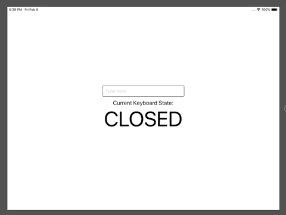

# react-native-ios-keyboard-events

**A `react-native` library to detect an Apple iOS device's keyboard state.**

Especially useful if you need to detect a split keyboard on an iPad (so that you can make UI adjustments to accomodate it)

Works _✨nicely✨_ with `KeyboardAvoidingView` 👍🏻



Example: [AppDemo.tsx](AppDemo.tsx)

## Usage (tldr)

1. Install the library

```bash
npm install react-native-ios-keyboard-events
```

2. Create an `IOSKeyboardEvents` instance

```javascript
import { createIOSKeyboardEvents } from "react-native-ios-keyboard-events";
const IOSKbEvents = createIOSKeyboardEvents();
```

3. Listen to keyboard state changes 😀

```javascript
IOSKbEvents.addListener(
  "some-listener-name",
  (newKeyboardState, previousState) =>
    console.log(`transition: ${previousState} -> ${newKeyboardState}`),
);
```

4. Close it when you're done

```javascript
IOSKbEvents.close();
```

## API

### Constructor

#### `createIOSKeyboardEvents(options)`

Creates an `IOSKeyboardEvents` instance.

This method will attempt to detect the device model type by checking the device's window resolution (via `Dimensions.get`). It will error out if it is unable to find a matching device or if the library is run in a non-iOS device.

`options`:

- `keyboardEventDebounceTime`: (default: 100) Defines the time (in ms) to debounce sending updates to registered listeners. Increase to smoothen out keyboard state changes.

(Note: keyboard state changes may flicker on certain transitions eg. `CLOSED` -> `DOCKED`, due to the nature in which Apple sends out keyboard notifications and this library, in turn, interpreting the events)

- `deviceModel`: Passes in a manually-defined `IDeviceModel` object. Useful when using custom keyboards. (note: if supplied, platform check will be ignored)

### Instance Methods

#### `.addListener(listenerName: string, callback: (newKeyboardState, previousState) => void)`

Adds a listener to the `IOSKeyboardEvents` instance. Calls the callback on any keyboard state change.

Note: Adding a new listener will override any existing listeners with the same `listenerName`.

#### `.removeListener(listenerName: string)`

Removes the listener with the corresponding `listenerName`.

#### `.close()`

Gracefully closes the `IOSKeyboardEvents` instance by unsubscribing from keyboard events, listeners, and timers.

#### `.getKeyboardState()`

Returns the present keyboard state.

Possible `KeyboardState`s:

- `CLOSED`
- `MINIMIZED`
- `DOCKED`
- `UNDOCKED`
- `SPLIT`
- `FLOATING` (iOS v13)

#### `.setKeyboardState(newKeyboardState: KeyboardState)`

Sets the instance's tracked keyboard state. Use it if, for one reason or another, the `IOSKeyboardEvents` instance's internal state is inconsistent with the actual keyboard state. (eg. Keyboard is `MINIMIZED` but instance reports as the keyboard being `DOCKED`). This may occur as this library listens to `Keyboard` events to determine the keyboard state.

Throws an error if input is not a `KeyboardState` value.

Note: This method does NOT do keyboard actions (eg. dismissing the keyboard)

#### `.getDeviceModelInformation()`

Returns the matched detected device. (or manually-defined `IDeviceModel` object)

## Compatibility

### Platform

- `iOS` only
- iOS versions `12.x` and `13.x`
- `React Native` >= 0.58.1
- `React` >= 16.6.3
- Also works for iPhone-only apps on iPad

### Supported Devices

#### Phones

- iPhone 5s/SE
- iPhone 6/6s/7/8
- iPhone 6/6s/7/8 Plus
- iPhone X
- iPhone XS/XS Max
- iPhone XR
- iPhone 11/11 Pro/11 Pro Max

#### Tablets

- iPad (5th/6th generation)
- iPad Air/Air 2/3rd generation
- iPad Pro (9.7-inch)
- iPad Pro (10.5-inch)
- iPad Pro (11-inch)
- iPad Pro (12.9-inch) (1st/2nd/3rd generation)

## Contributing

Bugs? Feature requests? Clarifications? Raise an issue/PR :)

## Release notes

See [Release Notes](docs/release-notes.md)

#### Dev box prerequisites

- `react-native-cli`
- xcode version >=10
